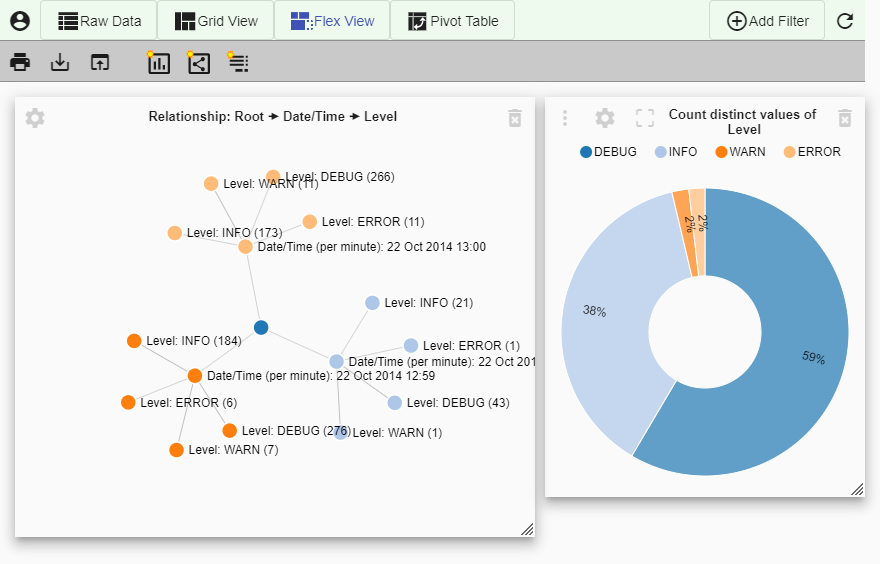
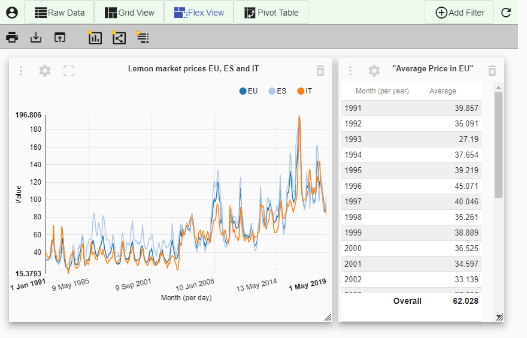

# Koia Data Visualization

## What is Koia?


Koia is an [angular-based](https://angular.io/), open-source web application for visualizing and analyzing table-like data structures. It offers a modern and minimalistic approach for creating flat tables, pivot-tables, summaries, relationship graphs and charts of your data.

Koia has originally been developed for analyzing and visualizing **log data** collected and structured with the [**Retrospective Log Analyzer**](https://retrospective.centeractive.com/)
 from files (local and remote), [Docker](https://www.docker.com/) and [Kubernetes](https://kubernetes.io/).

Use Koia straight away at [**https://www.koia.io**](https://www.koia.io) or continue reading.

## Why Koia?

Koia differs from similar programs mainly in that the **context to the original data** is never lost. You are always only a mouseclick apart from seeing the raw data on which the displayed element or value is based.

Next to this, Koia enables the **uploading of multiple data sets**, so it is possible to create graphics based on different data without opening a lot of tabs in your browser but **switching between the data sets in one tab**.

## How it works

Data is loaded from files (CSV, Excel or JSON) to the browser's IndexedDB or a local CouchDB through Koia itself or it may be written to it by a third party program. Uploaded data from an individual file are represented by a **scene**. You can switch between different scenes as you please to create diagrams based on different data.

The data can be viewed, filtered and sorted in a **raw data table** or it may be refined and displayed as **charts, relationship graphs, summary or pivot tables** with a few mouseclicks. To gain insights into your data, Koia offers a variety of chart types such as: Pie charts, donut charts, bar charts, line charts, area charts, scatter charts and sunburst charts.

Besides simply visualizing data, Koia also features **time and value filters** to present a closer look at diagrams and the numbers behind them.

 When satisfied with the outcome, users can **save** the current view or **export** data to use it elsewhere.

 

 **Picture 1:** Relationship graph showing the time/log level relation of log entries and a pie/scatter chart showing the occurance of the log levels.

 

 **Picture 2:** Line chart of market prices over the course of several years and the according summmaries with the average prices for each year and in total.

## Getting Started

It is recommended to use [CouchDB](http://couchdb.apache.org/) as described down below since the data scenes in Koia will be lost when the browser cache is emptied when using the IndexedDB.

### Installing

1. Download and install CouchDB from [http://couchdb.apache.org/#download](http://couchdb.apache.org/#download). Follow the installation wizard steps.
2. Open [http://127.0.0.1:5984/_utils#setup](http://127.0.0.1:5984/_utils#setup) and perform CouchDB single node setup according to [http://docs.couchdb.org/en/stable/setup/single-node.html](http://docs.couchdb.org/en/stable/setup/single-node.html). You will get asked for an admin username and password, choose the default admin/admin or whatever suits you.
3. Configure CORS by changing [http] and [cors] entries within the configuration file `$COUCHDB_HOME/etc/local.ini` as follows:

   ```text
   [httpd]
   enable_cors = true

   [cors]
   origins = *
   methods = GET,POST,PUT,DELETE
   credentials = true
   ```

4. After editing the configuration file, CouchDB should be restarted to have the changes applied.
5. Start Koia by opening [**https://www.koia.io**](https://www.koia.io).

## License

Koia is [MIT licensed](LICENSE). Copyright (c) 2020 centeractive ag.
